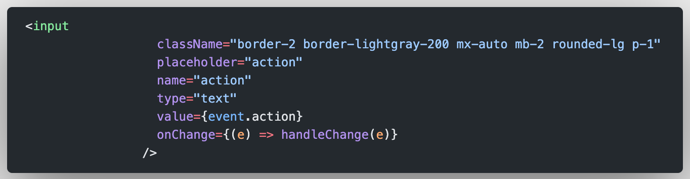
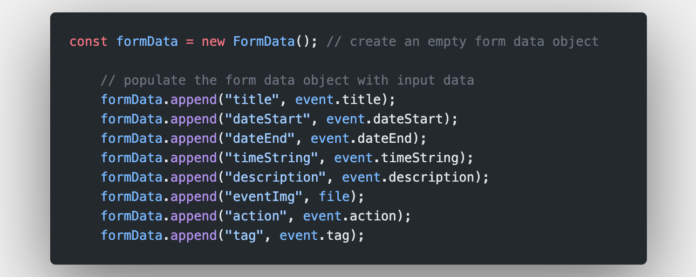

# HWA - Frontend

## Image file storage in MongoDB

A dedicated route `/admin` allows for potential users to skip the hassle of interacting with the database to create new information, specifically for the events creation, updating and deleting.

We encountered a challenge here, where part of the CRUD functionality involves working with images. A quick workaround would be to get the user to host the image in a free hosting site, and only have the image url passed and stored into the database to be retrieved later on for rendering purposes.

Instead, we chose to have a single point of access to all these information, and hence had to deal with not only text but image files being stored in the database. This was something new to us, and after much reading, we decided to do the in following manner:

1. Firstly, on the client side, in the form tag for the input fields of various information, there needs to be an input field of `type="file"` in order to allow for user to select a file from locally that user will want to be uploaded to the server.



2. Once user submits the form, the form needs to be structured in a `FormData` object, which uses the encoding type of `"multipart/form-data"`.
3. The relevant input fields would then need to be key/value pairs, and this is done with the `.append()` method.



4. The Form Data object would then need to be passed to the backend API endpoint using fetch. In this case, we defined the endpoint as a `PUT` method. In the headers, the content needs to match as so: `"Content-Type": "multipart/form-data"`, as required by the `multer` middleware.


And that's all on the client side of things.

## Additional Info

If you would like to further customize the site's appearance, feel free to refer to the styling guide below for more information!

#### 1. CSS Style Guide by Tyler

```HTML
    <div>
      <h4 className="bg-peach">Peach</h4>
      <h4 className="bg-primary-800">Green 800</h4>
      <h4 className="bg-primary-600">Green 600</h4>
      <h4 className="bg-primary-400">Green 400</h4>
      <h4 className="bg-primary-200">Green 200</h4>
      <h4 className="bg-white">White</h4>
      <h4 className="bg-secondary-600">Cool Grey 600</h4>
      <h4 className="bg-secondary-400">Cool Grey 400</h4>
      <h4 className="bg-secondary-200">Cool Grey 200</h4>
      <h4 className=" text-primary-800 border-primary-800">
        example : bg-primary-800 / text-primary-800 / border-primary-800
      </h4>
      <br></br>
      <h1>Heading One</h1>
      <span>^^^Dont need Style just use h1 tag</span>
      <p className="font-DM text-3xl font-medium">Heading Two</p>
      <h3>Heading Three </h3>
      <span>^^^Dont need Style just use h3 tag</span>
      <p className="font-DM text-xl font-normal">Body One</p>
      <p className="font-DM text-lg font-normal">Body Two</p>
      <p className="font-DM text-xl font-bold">Body One Bold</p>
      <p className="font-DM text-lg font-bold">Body Two Bold</p>
      <p className="font-DM text-base font-normal">Caption</p>
    </div>
```
